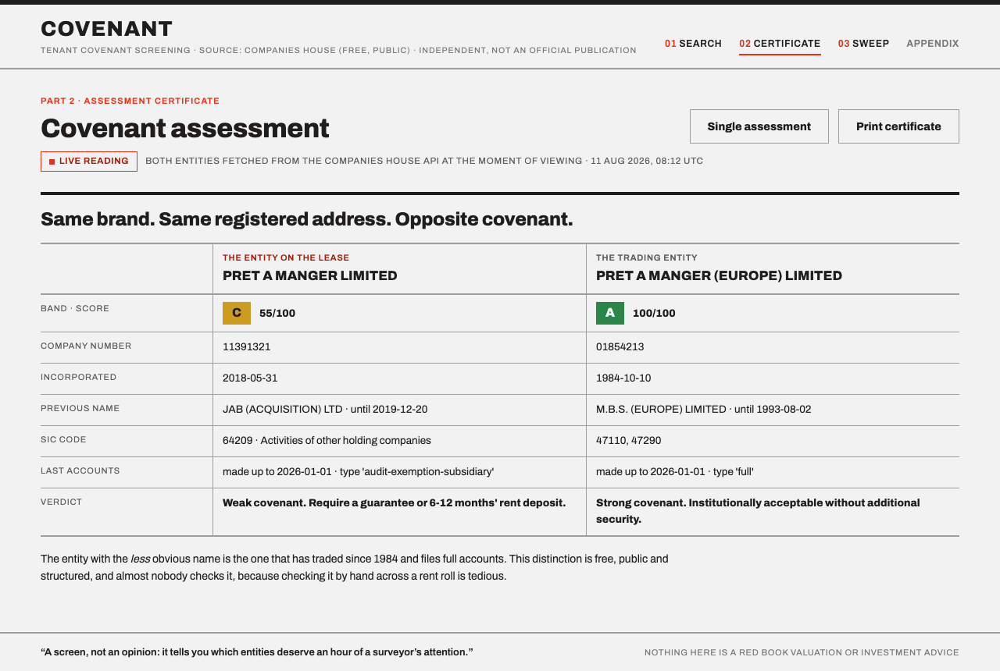
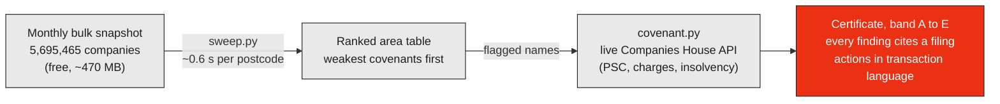
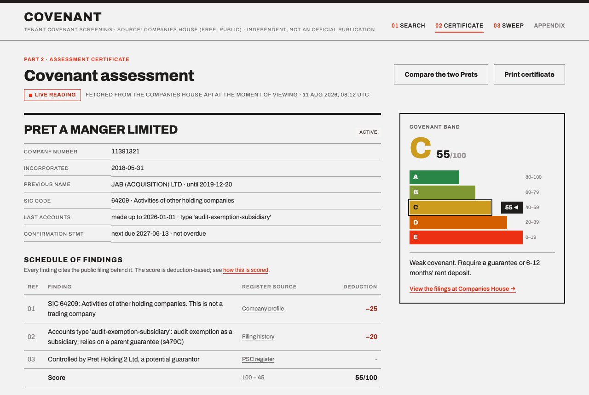
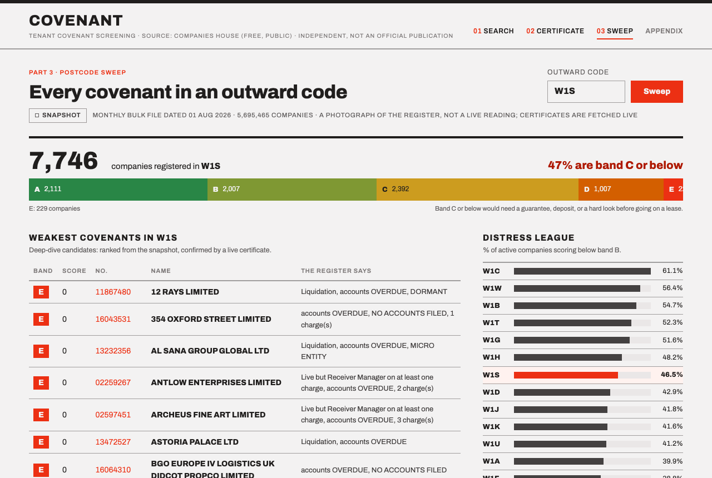

# Covenant

**Covenant strength screening for UK commercial tenants, from free Companies House data.**

[](LICENSE)
[](requirements.txt)
[](https://developer.company-information.service.gov.uk/)
[](https://github.com/akbar-33/covenant/actions/workflows/selftest.yml)

A lease has been offered by entity X. **Is that covenant real, and if not, where does the actual money sit?**

- **[▶ Live dashboard](https://covenant-wtpu.onrender.com)**: search any tenant, sweep any postcode, live against the register (free tier: first visit after idle takes ~30 s to wake)
- **[▶ Frozen capture](https://akbar-33.github.io/covenant/)**: the same dashboard on GitHub Pages (instant, never sleeps, inputs inactive)
- **[▶ Five-step demo narrative](DEMO.md)**: the story the tool tells, with real output

---

## The problem

In UK commercial property, the building is almost secondary: what you are buying is the rental income stream, and that stream is only as good as the tenant's ability to keep paying. Surveyors call this **covenant strength**, and they assess it constantly: today by paying a credit reference agency per report, or by eyeballing.

Meanwhile, every UK company files public, structured, machine-readable records at Companies House (for free), and buried in those records are the strongest early warnings of tenant failure. Almost nobody reads them systematically, because doing it by hand across a rent roll is tedious.

## The example that carries the whole idea

Search the register for "Pret A Manger" and 20 entities come back: several dissolved, two of them named *identically*. The two that matter:

| | [PRET A MANGER LIMITED](https://find-and-update.company-information.service.gov.uk/company/11391321) | [PRET A MANGER (EUROPE) LIMITED](https://find-and-update.company-information.service.gov.uk/company/01854213) |
|---|---|---|
| Company number | 11391321 | 01854213 |
| Looks like | the famous sandwich chain | some subsidiary |
| Actually is | a 2018 acquisition vehicle, formerly **JAB (ACQUISITION) LTD** | the trading company, since **1984** |
| SIC code | 64209 · *holding company* | 47110/47290 · retail (trading) |
| Accounts | audit-exemption-subsidiary (s479C) | **full accounts** |
| **Covenant** | **Band C · 55/100.** Require a guarantee or deposit | **Band A · 100/100.** Institutionally acceptable |

Same brand. Same registered address. Opposite covenant. **A landlord who signs the first entity thinks they have the sandwich chain: they have a shell.** That distinction is free, public, and structured; this repo is the machinery for checking it at any scale from one tenant to the whole country.

Here is that exact comparison, live in the dashboard:



---

## How the pipeline fits together



The two data sources have different currencies, kept visibly distinct everywhere: the sweep is a photograph of the register dated the 1st of the month; a certificate is fetched live at the moment you look at it.

## What it looks like

The assessment certificate · deduction ledger on the left (every finding linked to the register page that evidences it), EPC-style band scale on the right:



The postcode sweep · 7,746 companies scored, band distribution, the weakest names, a distress league across the W1 district and a sector panel:



---

## What's in the repo

```
covenant.py     screen ONE tenant     · live Companies House REST API
sweep.py        screen an AREA        · DuckDB over the free monthly bulk
                                        snapshot (5.7M companies)
app.py          the dashboard         · Flask, both engines behind the
                                        Claude-designed front-end
freeze.py       docs/ generator       · frozen static capture for GitHub Pages
templates/ + static/                  · the dashboard UI
DEMO.md         the five-step demo narrative with captured real output
```

### `covenant.py` · one tenant, live

```bash
python covenant.py "Pret A Manger"     # disambiguate the entity
python covenant.py 01854213            # assess one
python covenant.py 01854213 --json     # for a pipeline
python covenant.py --selftest          # prove the scoring; no key, no network
```

Returns a band **A–E**, a score /100, a schedule of findings **each traced to the filing that caused it**, and recommended actions in transaction language: *take a 12-month rent deposit*, *the parent that gave the s479C guarantee is your real covenant; assess that entity instead*.

### `sweep.py` · a whole area, offline

The REST API answers "tell me about company X". It cannot answer "who is registered *here*". The free [monthly bulk snapshot](https://download.companieshouse.gov.uk/en_output.html) can:

```bash
python sweep.py --build BasicCompanyDataAsOneFile-YYYY-MM-01.csv   # once: 2.6GB CSV -> ~190MB parquet
python sweep.py W1S                    # every company in an outward code, worst first
python sweep.py W1S --csv w1s.csv      # full ranked table for a spreadsheet
python sweep.py W1S --sectors          # which sectors are weakest
python sweep.py --stats W1             # distress league across outward codes
```

Real output (snapshot 01 Aug 2026): **W1S (Mayfair) holds 7,746 registered companies, 47% band C or below**: the weakest include live companies with receiver-managers on their charges and a 2024 propco at 354 Oxford Street whose first accounts are already overdue. Each sweep runs in ~0.6 s.

### `app.py` · the dashboard

```bash
python app.py     # -> http://localhost:8321
```

Four views: entity search → assessment certificate (with the deduction ledger, an EPC-style band scale, and a print layout) → two-entity comparison → postcode sweep with a distress league and sector panel. Search and certificates hit the live API; sweeps run on the local snapshot. A hosted **frozen capture** of all four is on [GitHub Pages](https://akbar-33.github.io/covenant/): same pages, real data, inputs inactive.

---

## Setup

```bash
git clone https://github.com/akbar-33/covenant && cd covenant
pip install -r requirements.txt          # requests, duckdb, flask
export CH_API_KEY=...                    # free, instant:
                                         # developer.company-information.service.gov.uk
```

`COMPANIES_HOUSE_API_KEY` works as the variable name too, and a local `.env` file containing either is picked up by the dashboard. The CLI and dashboard work immediately; area sweeps additionally need the one-time `--build` of the bulk snapshot (~470 MB download).

`python covenant.py --selftest` needs **no key and no network**; it runs the scoring against captured real payloads and asserts, among other things, that the Pret trading entity must outrank the holding vehicle.

## How the scoring works

Deduction-based: every company starts at 100 and each finding subtracts a stated amount, so a score is an audit trail, not an opinion. All signals are **structured register fields**; nothing is parsed out of PDFs, no credit agency is involved.

| Signal (register field) | Deduction | Why a surveyor cares |
|---|---|---|
| Dissolved / closed | −100 | The entity no longer exists; the lease has no covenant |
| Liquidation, administration, receivership | −85 | The covenant has already failed |
| Other non-active status | −60 | |
| Dormant accounts | −45 | The entity does not trade |
| **Accounts overdue** | −30 | The single best early public warning of distress |
| Micro-entity accounts | −30 | Turnover under £1m: thin covenant |
| No accounts filed yet | −25 | No trading record at all |
| Non-trading SIC (64209, 70100, 68209…) | −25 | A holding/propco vehicle, not a business |
| Insolvency history | −25 | |
| Audit-exemption-subsidiary accounts | −20 | The real covenant is the s479C guarantor parent |
| Incorporated under 2 years | −20 | No track record |
| Accounts >1.8 years stale | −15 | The filed position is out of date |
| Registered office disputed / undeliverable | −15 | |
| Confirmation statement overdue | −12 | Entity not being actively administered |
| Small-company exemption accounts | −12 / −10 | No audit, no P&L |
| Floating charge over the undertaking | −8 | Captures the assets a landlord would distrain against |
| Renamed within 5 years | −6 | Check continuity of trade |
| Each outstanding charge | −4 (max −20) | Secured lenders rank ahead of the landlord |

**Bands:** A 80–100 · B 60–79 · C 40–59 · D 20–39 · E 0–19. Two deliberate consequences worth knowing: entities in liquidation correctly pile up at the bottom of every sweep (a screen that didn't put them there would be broken), and propco SICs are structurally marked down: a propco shell *is* a weak covenant unless guaranteed, and the guarantor-assessment path is the remedy.

## Data sources and provenance

Two sources with **different currencies**, kept visibly distinct in the UI:

| Source | Currency | Used by |
|---|---|---|
| [Companies House REST API](https://developer.company-information.service.gov.uk/) | **Live**, fetched at the moment of viewing | `covenant.py`, dashboard search + certificates |
| [Free monthly bulk snapshot](https://download.companieshouse.gov.uk/en_output.html) | A **photograph** dated the 1st of the month | `sweep.py`, dashboard sweeps |

The API is rate-limited at 600 requests/5 min; a full assessment costs ≤3 calls. The snapshot is ~470 MB zipped, and `sweep.py --build` distils it once to a ~190 MB Parquet queried by DuckDB in-place.

## Limitations, stated because they matter

- **Registered ≠ trading addresses.** Many companies register at an accountant; 52% of W1S companies sit at just 20 addresses. A sweep finds the companies anchored to a place, not the shopfronts on it. (This is also why there is deliberately no dot-map in the dashboard.)
- **No financial figures.** Turnover and net assets live in iXBRL accounts documents, and many filers submit scanned image PDFs. The tool stops where free structured data stops rather than guessing.
- **Registered UK companies only.** Not sole traders, partnerships, or overseas entities without a UK registration; the dashboard's appendix shows what to do in each of those cases.
- **A screen, not an opinion.** It tells you which entities deserve an hour of a surveyor's attention. Nothing here is a Red Book valuation, a credit rating, or investment advice.

## Roadmap

1. **VOA rating-list join**: map covenant bands onto actual trading occupiers, floor areas and rateable values: "£Xm of rateable value in W1 sits on band-D covenants."
2. **Covenant watch**: the Companies House streaming API pushes filing events in real time; alert a landlord the day a tenant goes accounts-overdue or grants a floating charge.
3. **Rent cover**: parse iXBRL accounts where they exist; coverage will be partial and will say so.

## Sibling project

[**oversight**](https://github.com/akbar-33/oversight) · records tooling for the RICS professional standard *Responsible use of AI in surveying practice*, in force since 9 March 2026. A firm using covenant on real instructions has obligations under that standard: an AI system register, a written reliability decision by a named surveyor for each material output, client disclosure. Oversight produces those records, and its worked example registers covenant as one of the firm's AI systems, with a real reliability decision for the Pret screening above.

One tool does surveying work with AI; the other governs AI to surveying standards. [Try the oversight sandbox](https://oversight-sandbox.onrender.com).

## Licence

[MIT](LICENSE). Contains public sector information licensed under the [Open Government Licence v3.0](https://www.nationalarchives.gov.uk/doc/open-government-licence/version/3/).
